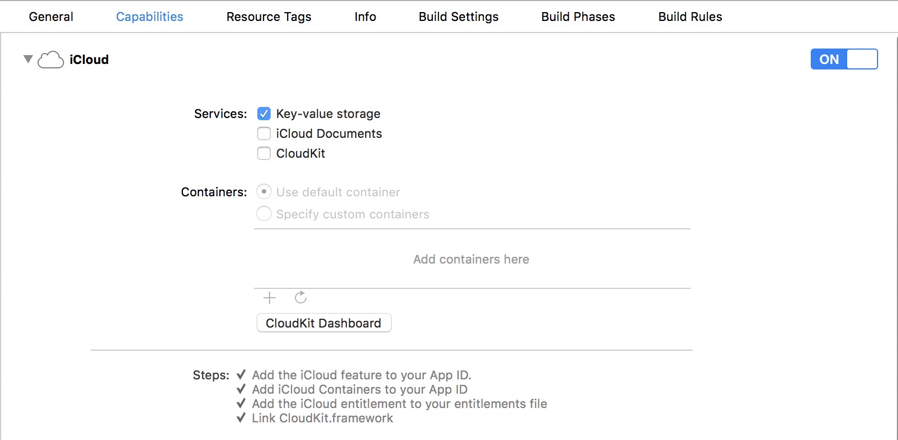

# MFSIdentifier
iOS App获取**唯一标识符**方案

| 是否刷机/还原  | 是否卸载重装APP   | 获取方式及优先级 | 
| :----: | :------: | :-------------: |
|    否  |    否    |   MFSCache、NSUserDefaults  |
|    否  |    是    |   KeyChain、Safari Cookie、iCloud、IDFA、IDFV、NSUUID |
|    是  |    是    |   iCloud、IDFA、IDFV、NSUUID |

### 使用  

```
#import <MFSIdentifier/MFSIdentifier.h>

NSString *deviceID = [MFSIdentifier deviceID];
NSLog(@"deviceId: %@", deviceID);
```

### 安装  

#### CocoaPods

```
编辑Pofile
pod 'MFSIdentifier', '1.0.1'
```

```
安装
pod install
```

更多关于[CocoaPods](https://cocoapods.org/)

#### Carthage
```
编辑Cartfile
github "maxfong/MFSIdentifier" >= 1.0.1
```

```
安装
carthage update
```

更多关于[Carthage](https://github.com/Carthage/Carthage)

**使用Framework，工程Other Linker Flags需添加-ObjC**

### 注意
1. Safari Cookie支持需iOS9.0及以上。
2. 可设置[MFSCacheUtility registerAESKey:]，其他应用获取了Cookie也无法正确解密  
3. 刷机后能获取相同标识符需开启iCloud
 
 
 
### 其他
如果您发现任何问题或有啥建议，发个issues，谢谢

### License
MFSIdentifier is available under the MIT license. See the LICENSE file for more info.
